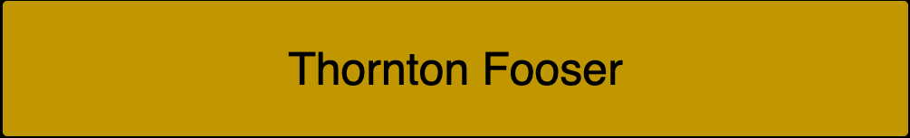
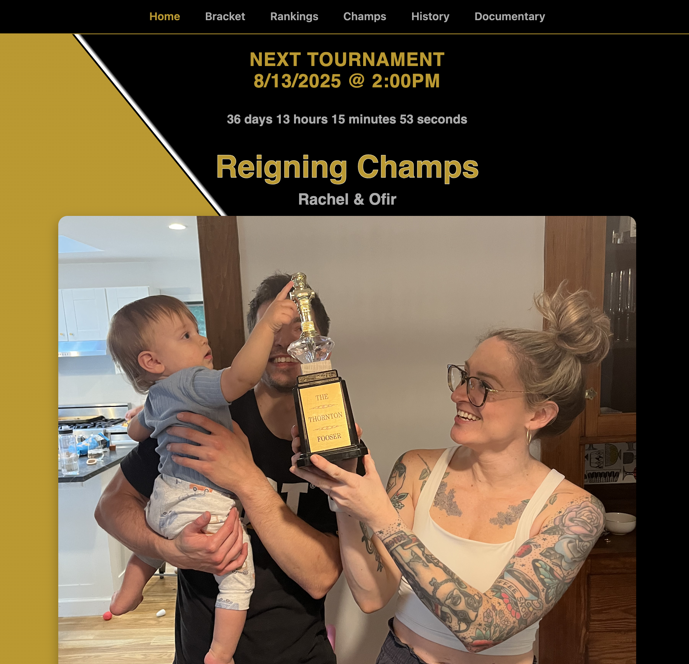
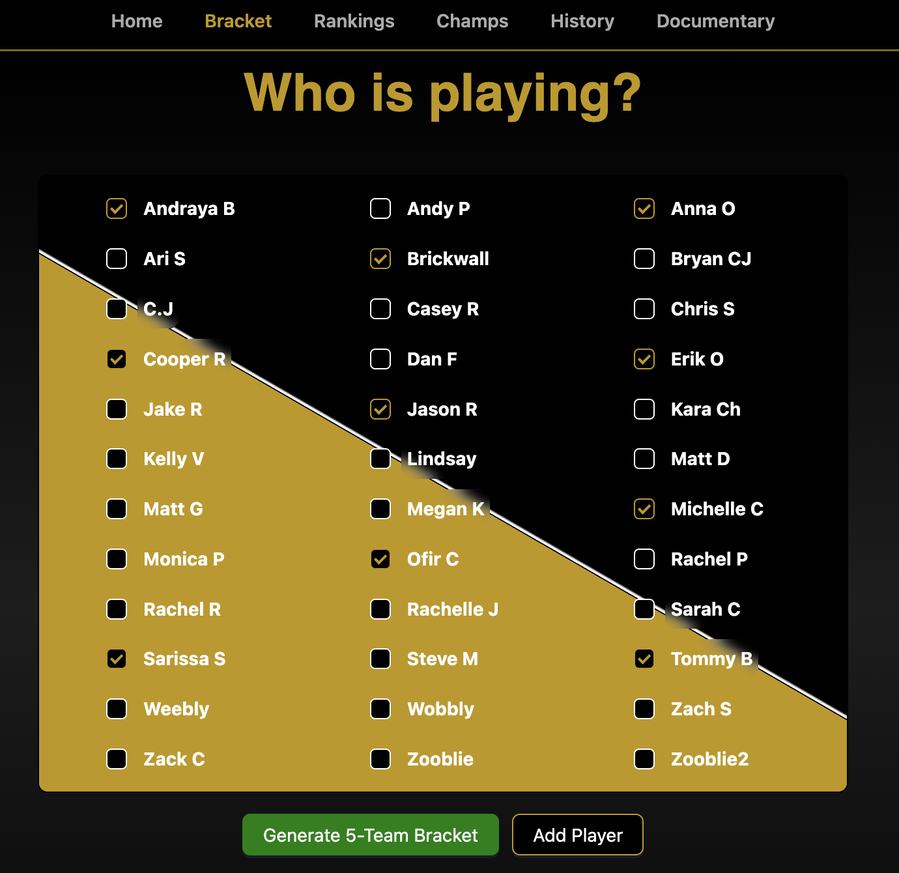
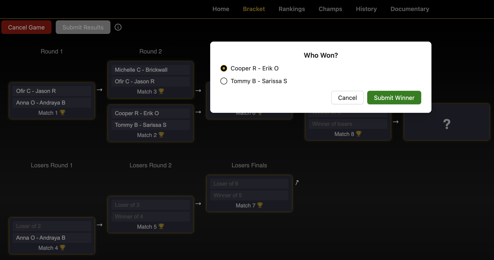
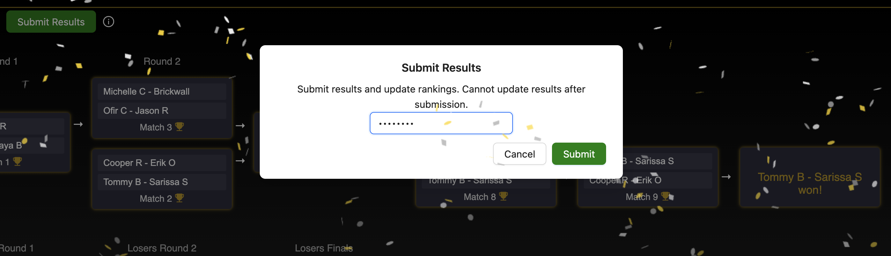
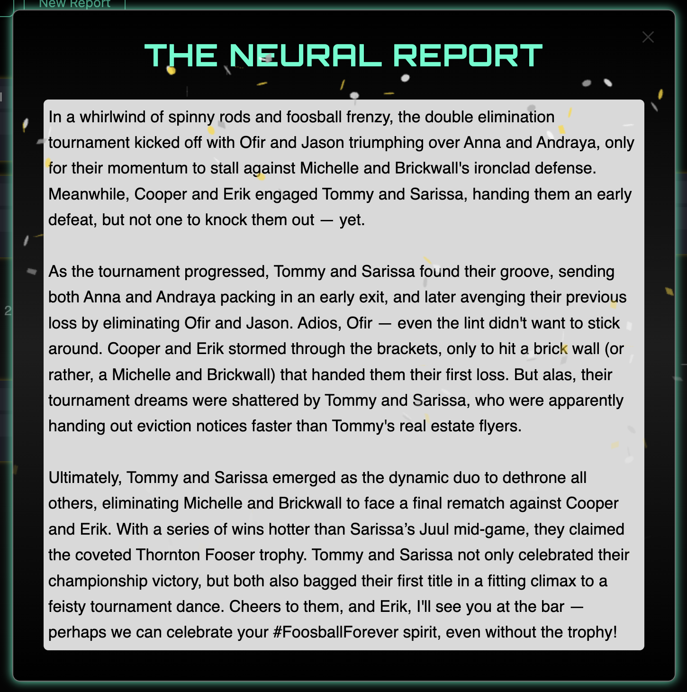
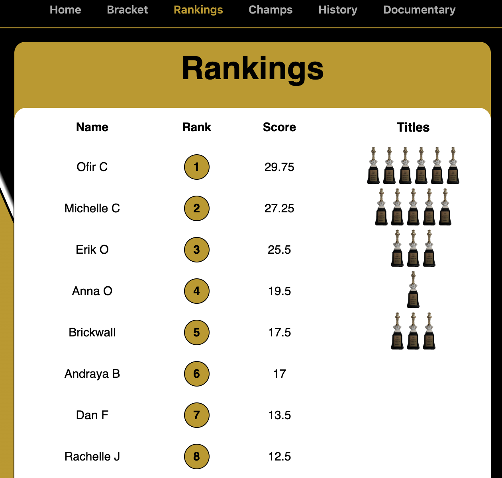
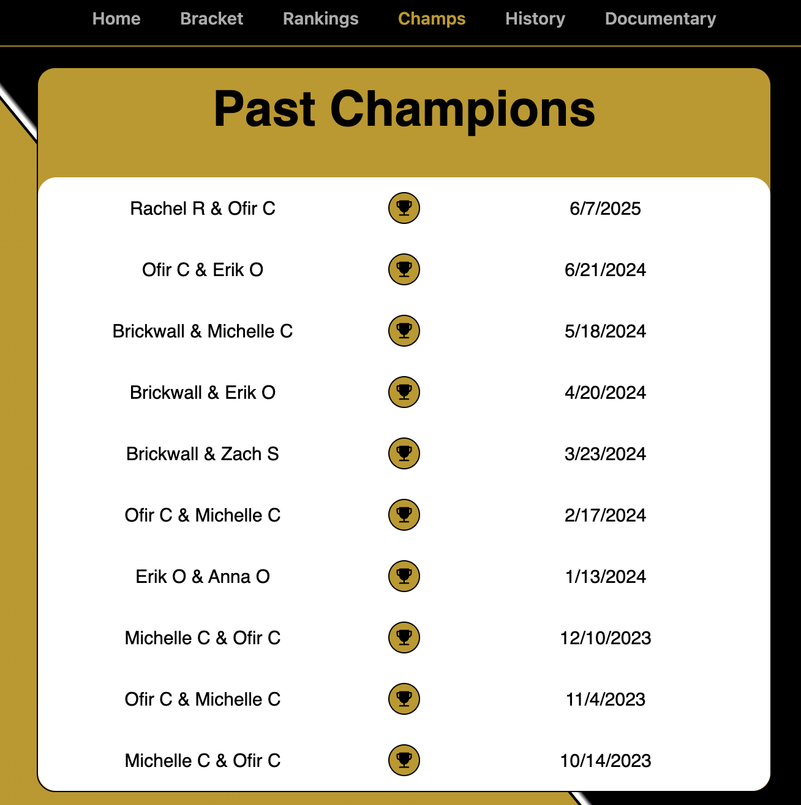
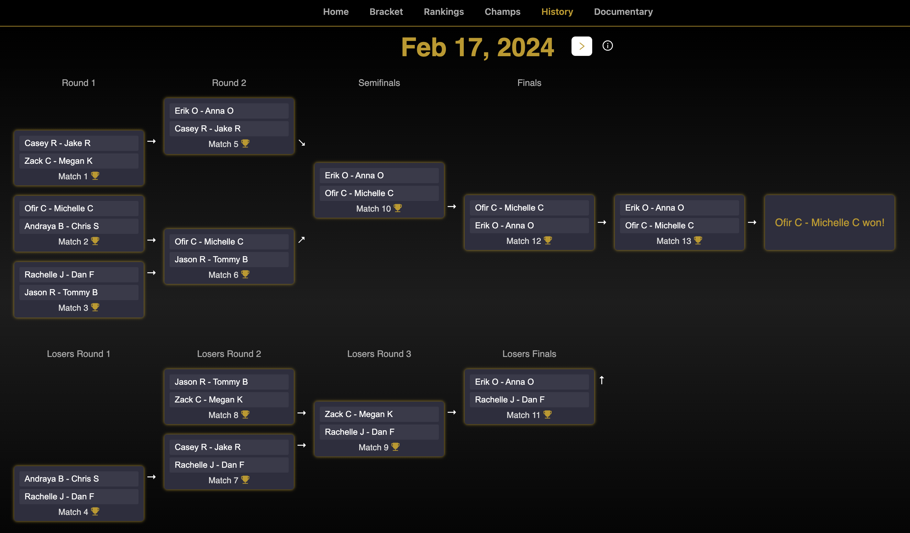

  

 

  

 

The **Thornton Fooser Frontend** is a responsive web app built with React and TypeScript for running foosball tournaments, tracking scores, and keeping player rankings up to date. It's designed to be easy to use, fun, and competitive—perfect for friendly matches and intense rivalries.

### ✨ Features

- 🏆 **Dynamic Tournament Bracket Generation**
- 📈 **Live Match Tracking**
- 🗣️ **Real-Time Chat Integration**
- 🎭 **AI-Generated Funny Tournament Summaries**
- 📱 **Fully Responsive and Mobile-Ready UI**
- 🎉 **Confetti animations** for tournament victories
- 🔐 **Admin-Only Controls**

### 🧑‍💻 Technologies Used

|                                                                                                                         |
| ----------------------------------------------------------------------------------------------------------------------- |
|                      |
|        |
|                          |
|       |
|  |
|                    |
|        |
|      |
|                   |

### 🕹️ Using the App

|                                                                                                                                                         |                                                                                                                                                  |
| ------------------------------------------------------------------------------------------------------------------------------------------------------- | ------------------------------------------------------------------------------------------------------------------------------------------------ |
|                                                                    | Welcome to Thornton Fooser! Celebrate the latest champions and get hyped with a live countdown clock ticking down to the next foosball showdown. |
| Choose players to generate a dynamic tournament bracket. Select your participants, hit **Generate Bracket**, and you're ready to start the competition! |                                                                    |
|                                                                          | Real-time tracking of match progress, clearly marking winners and losers as the tournament unfolds.                                              |
| Admins can securely submit match results and update player rankings by entering a secret admin code.                                                    |                                                      |
|                                                                          | After a tournament concludes, enjoy a humorous AI-generated summary highlighting key moments, notable players, and playful commentary.           |
| View updated player rankings based on tournament results, scores, and total championships won.                                                          |                                                                        |
|                                                                       | Browse past champions and dates of their victories, showcasing historical tournament winners.                                                    |
| Review detailed tournament bracket history, showing the progression and outcomes of previous tournaments.                                               |                                                               |
